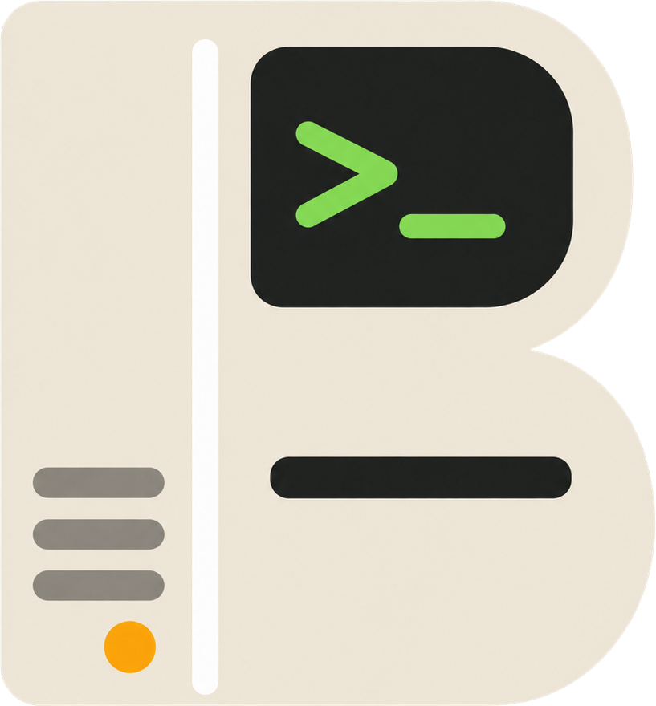
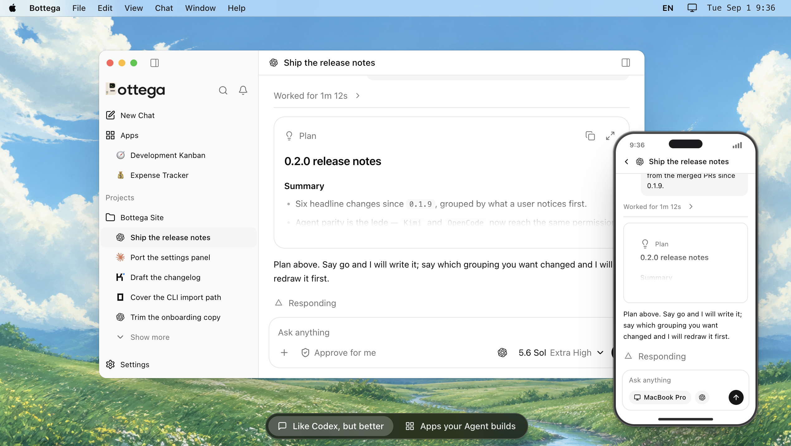

<p align="center">
  
</p>

<h1 align="center">Bottega</h1>

<p align="center"><strong>The workshop that builds itself.</strong></p>

<p align="center">
  Bottega is an open-source, local-first desktop workspace for Codex, Claude Code, Kimi Code, and OpenCode.<br>
  Turn Agent conversations into durable workspaces with Base, Apps, Memory, browser tools, and multi-agent collaboration—while credentials stay with the official local CLIs.
</p>

<p align="center">
  <a href="https://github.com/thinkingjimmy/Bottega/releases/latest"></a>
  <a href="https://github.com/thinkingjimmy/Bottega/stargazers"></a>
  <a href="./LICENSE"></a>
</p>

<p align="center">
  <a href="https://www.getbottega.app">Website</a> ·
  <a href="./docs/README.md">Docs</a> ·
  <a href="./docs/getting-started/README.md">Quickstart</a> ·
  <a href="https://github.com/thinkingjimmy/Bottega/releases/latest">Download</a> ·
  <a href="./docs/features/README.md">Features</a> ·
  <a href="./docs/changelog/README.md">Changelog</a> ·
  <a href="https://x.com/hellojimmywong">X</a>
</p>

<p align="center">
  <strong>English</strong> | <a href="./docs/README.zh-CN.md">简体中文</a>
</p>

<p align="center">
  
</p>

# Key features

- **Your Agents, one sidebar.** Run Codex, Claude Code, Kimi Code, and OpenCode through their official local CLIs. Switch Agents for the next turn in an idle chat while keeping the same transcript.
- **Sketch your next prompt.** Draw, add text and shapes, and erase details in the composer. Keep sketches editable until they are sent as PNG images.
- **Build AI-native Apps.** Describe the workflow you need and turn it into a durable App with its own interface, data, and permissions—not another result trapped in a transcript.
- **Customize by chatting.** Open an editable App's source Chat, describe the change, and let your Agent update its features, data, and interface directly.
- **Every Chat, one data space.** Give a Chat or Project a structured Base, then work with the same rows as a table, list, Kanban board, map, chart, or gallery.
- **Sync it, or keep it local.** Cloud Sync is optional and off until you turn it on. When you do, content is end-to-end encrypted with a sync password that only you hold, and the server never sees your plain text.
- **Open your workspace in a browser.** Sign in at [app.getbottega.app](https://app.getbottega.app) to read and edit your Chats, Bases, and Apps from another computer or a phone.

[Explore the complete feature guide →](https://www.getbottega.app/features/agents/)

# Get started

Choose a prebuilt desktop release or run Bottega directly from source. Before launching, install and authenticate at least one supported CLI: Codex, Claude Code, Kimi Code, or OpenCode.

## Download

[Download the latest release →](https://github.com/thinkingjimmy/Bottega/releases/latest)

| Platform | Download |
| --- | --- |
| macOS (Apple silicon) | DMG or ZIP |
| Windows (x64) | NSIS installer |
| Linux (x64) | AppImage |

The builds are **not code-signed** yet, so each platform needs a one-time step.

**macOS (Apple silicon).** Open the DMG and drag Bottega into `Applications`. Double-clicking it now makes macOS report that the app "is damaged and can't be opened": that is Gatekeeper's quarantine flag on an unsigned download, not a broken file. Clear the flag once from Terminal, then launch normally:

```bash
xattr -rd com.apple.quarantine /Applications/Bottega.app
```

**Windows (x64).** SmartScreen shows "Windows protected your PC". Choose **More info**, then **Run anyway**.

**Linux (x64).** Make the AppImage executable and run it:

```bash
chmod +x Bottega-*-linux-x86_64.AppImage && ./Bottega-*-linux-x86_64.AppImage
```

Bottega drives the Codex, Claude Code, Kimi Code, and OpenCode CLIs already installed and logged in on your machine. On first launch, choose whether to work on this computer only or sign in to an existing account, pick your Bottega folder, let Bottega detect the CLIs, then create a task and choose its Agent before sending the first message. The [getting-started guide](./docs/getting-started/README.md) lists the supported CLI versions.

## Build from source

Requires Node.js 22.12 or newer and pnpm 11 or newer.

```bash
git clone --recurse-submodules https://github.com/thinkingjimmy/Bottega.git
cd Bottega
corepack enable
pnpm install
pnpm dev
```

To create a production build or a local installer:

```bash
pnpm build
pnpm dist
```

See the [getting-started guide](./docs/getting-started/README.md) for requirements, supported Agent CLIs, build commands, and the repository boundary.

# Collaboration

Please use [GitHub Issues](https://github.com/thinkingjimmy/Bottega/issues) for bugs, feedback, and proposals. Pull requests are not accepted during this early, fast-moving stage and will be closed without review.

Bottega is available under the [MIT License](./LICENSE).
