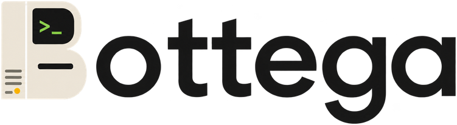

<p align="center">
  
</p>

# Bottega

Bottega is a local-first macOS workspace for Codex, Claude Code, Kimi Code, and OpenCode. It turns Agent conversations into durable workspaces with Base, Apps, Memory, browser tools, and multi-agent collaboration while leaving credentials with the official local CLIs.

Bottega v0.1.0 is available on the [Releases page](https://github.com/thinkingjimmy/Bottega/releases): a macOS arm64 DMG and ZIP, a Windows x64 installer, and a Linux x64 AppImage.

## Install

The builds are **not code-signed** yet, so each desktop platform needs a one-time step.

**macOS (Apple silicon).** Open the DMG and drag Bottega into `Applications`. Double-clicking it now makes macOS report that the app "is damaged and can't be opened": that is Gatekeeper's quarantine flag on an unsigned download, not a broken file. Clear the flag once from Terminal, then launch normally:

```bash
xattr -rd com.apple.quarantine /Applications/Bottega.app
```

**Windows (x64).** SmartScreen shows "Windows protected your PC". Choose **More info**, then **Run anyway**.

**Linux (x64).** Make the AppImage executable and run it:

```bash
chmod +x Bottega-0.1.0-linux-x86_64.AppImage && ./Bottega-0.1.0-linux-x86_64.AppImage
```

Bottega drives the Codex, Claude Code, Kimi Code, and OpenCode CLIs already installed and logged in on your machine. On first launch, pick a Chat Homes directory, let Bottega detect the CLIs, create a task, and choose its Agent before sending the first message. The [getting-started guide](./docs/getting-started/README.md) lists the supported CLI versions.

[Documentation](./docs/README.md) · [简体中文](./docs/README.zh-CN.md) · [Features](./docs/features/README.md) · [Changelog](./docs/changelog/README.md)

## Build from source

    git clone --recurse-submodules https://github.com/thinkingjimmy/Bottega.git
    cd Bottega
    corepack enable
    pnpm install
    pnpm dev

See the [getting-started guide](./docs/getting-started/README.md) for requirements, supported Agent CLIs, build commands, and the repository boundary.

## Collaboration

Please use [GitHub Issues](https://github.com/thinkingjimmy/Bottega/issues) for bugs, feedback, and proposals. Pull requests are not accepted during this early, fast-moving stage and will be closed without review.

Bottega is available under the [MIT License](./LICENSE).
