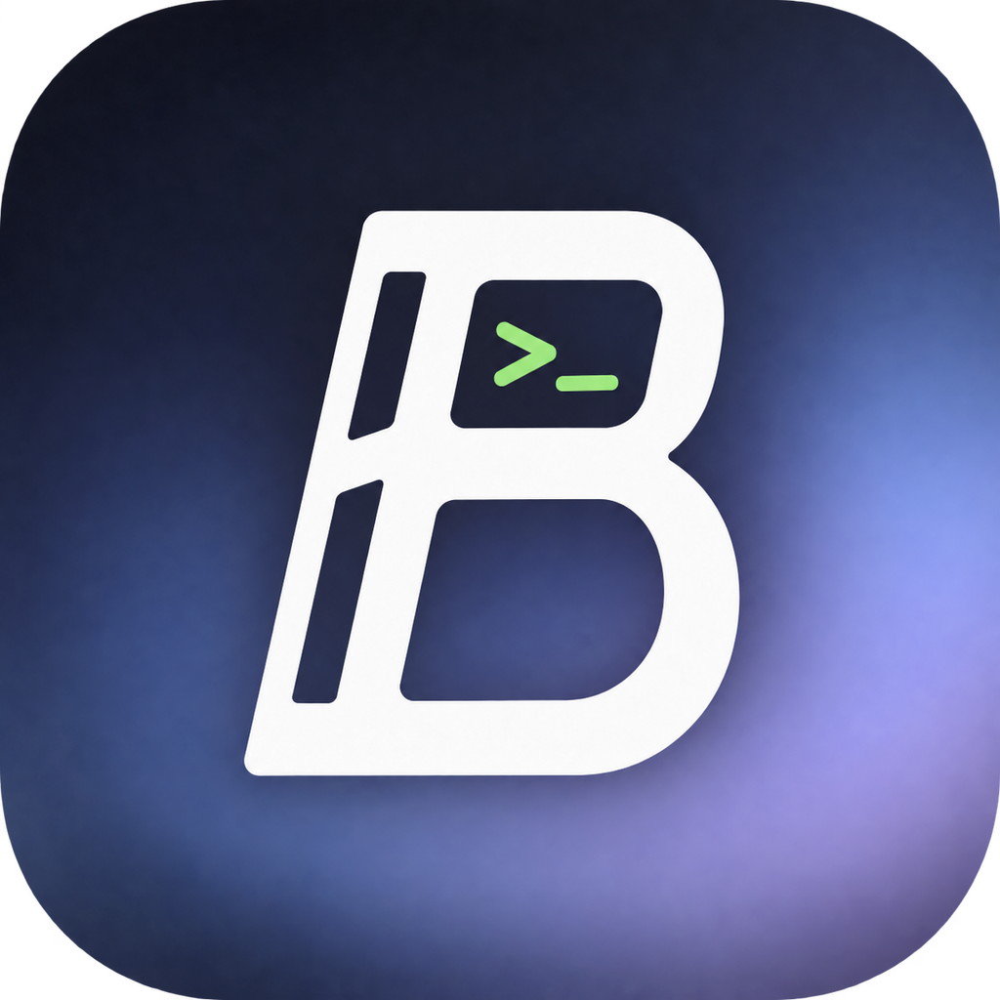
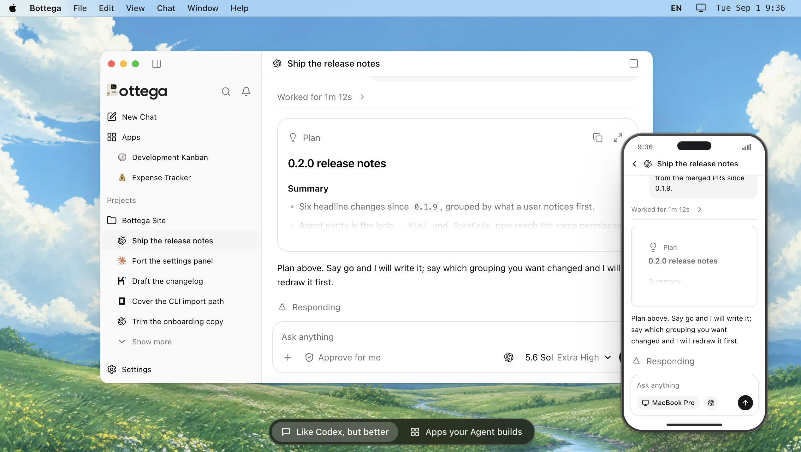

<p align="center">
  
</p>

<h1 align="center">Bottega</h1>

<p align="center"><strong>The workshop that builds itself.</strong></p>

<p align="center">
  Bottega is an open-source, local-first desktop workspace for Codex, Claude Code, Kimi Code, and OpenCode.<br>
  Turn Agent conversations into durable workspaces with Base, Apps, Memory, browser tools, and multi-agent collaboration—while credentials stay with the official local CLIs.
</p>

<p align="center">
  <a href="https://github.com/thinkingjimmy/Bottega/releases/tag/v0.2.0"></a>
  <a href="https://github.com/thinkingjimmy/Bottega/stargazers"></a>
  <a href="./LICENSE"></a>
</p>

<p align="center">
  <a href="https://www.getbottega.app">Website</a> ·
  <a href="./docs/README.md">Docs</a> ·
  <a href="./docs/getting-started/README.md">Quickstart</a> ·
  <a href="https://github.com/thinkingjimmy/Bottega/releases/tag/v0.2.0">Download</a> ·
  <a href="./docs/features/README.md">Features</a> ·
  <a href="./docs/changelog/README.md">Changelog</a> ·
  <a href="https://x.com/hellojimmywong">X</a>
</p>

<p align="center">
  <strong>English</strong> | <a href="./docs/README.zh-CN.md">简体中文</a>
</p>

<p align="center">
  
</p>

# 0.2.0

[Download 0.2.0](https://github.com/thinkingjimmy/Bottega/releases/tag/v0.2.0) for **macOS on Apple silicon**, or open [Bottega Web](https://app.getbottega.app). This is an early-access prerelease with manual updates. Apple Developer enrollment is pending; the macOS package uses ad-hoc signatures and is not notarized. Windows, Linux, and Android distribution will follow separately.

# Key features

- **Your Agents, one sidebar.** Run Codex, Claude Code, Kimi Code, and OpenCode through their official local CLIs. Switch Agents for the next turn in an idle chat while keeping the same transcript.
- **Make the workspace yours.** Manage built-in plugins and their settings, choose Agent models and reasoning levels from dropdowns, and place Bottega Dock on your preferred display and edge.
- **Sketch your next prompt.** Draw, add text and shapes, and erase details in the composer. Keep sketches editable until they are sent as PNG images.
- **Build AI-native Apps.** Describe the workflow you need and turn it into a durable App with its own interface, data, and permissions—not another result trapped in a transcript.
- **Customize by chatting.** Open an editable App's source Chat, describe the change, and let your Agent update its features, data, and interface directly.
- **Every Chat, one data space.** Give a Chat or Project a structured Base, then work with the same rows as a table, list, Kanban board, map, chart, or gallery.
- **Plan, develop, review — as a workflow.** Turn on a workflow for a Project's Base: your Agents plan, develop, and review each task while you confirm the plan and decide on the result, from the desktop, a browser, or your phone.
- **Sync it, or keep it local.** Everyone starts on this computer. Sign in when you want your work on more than one device: content is end-to-end encrypted with a sync password that only you hold, and the server never sees your plain text.
- **Reach the computer that holds the work.** Signing in publishes that computer's sidebar to your account. Switch computers in the sidebar from a browser, a phone, or another desktop, and drive the one you need.
- **Open your workspace in a browser.** Sign in at [app.getbottega.app](https://app.getbottega.app) to read and edit your Chats, Bases, and Apps from another computer or a phone.

[Explore the complete feature guide →](https://www.getbottega.app/features/agents/)

# Get started

Choose a prebuilt desktop release or run Bottega directly from source. Before launching, install and authenticate at least one supported CLI: Codex, Claude Code, Kimi Code, or OpenCode.

## Download

[Download 0.2.0 →](https://github.com/thinkingjimmy/Bottega/releases/tag/v0.2.0)

| Platform | Download |
| --- | --- |
| macOS (Apple silicon) | DMG or ZIP |

0.2.0 ships for **macOS on Apple silicon only**. Automatic updates are disabled for this prerelease; download and replace the app manually. Quit Bottega and back up your Bottega folder and application data before upgrading.

The package has **ad-hoc signatures**, with no Developer ID signature or Apple notarization. Download the DMG or ZIP and `release-manifest.json` from the release page. Run `shasum -a 256` on the installer and compare the output with that installer's `sha256` in the manifest, then copy Bottega into `Applications`. See the [installation guide](./docs/getting-started/README.md#download-and-install) if macOS blocks the verified download.

Bottega drives the Codex, Claude Code, Kimi Code, and OpenCode CLIs already installed and logged in on your machine. On first launch, pick your Bottega folder, let Bottega detect the CLIs, then create a task and choose its Agent before sending the first message. Setup never asks about an account: signing in is a later step, from Settings. The [getting-started guide](./docs/getting-started/README.md) lists the supported CLI versions.

## Build from source

Requires a Mac with Apple silicon, Node.js 24, and pnpm 11.9 or newer.

```bash
git clone --recurse-submodules https://github.com/thinkingjimmy/Bottega.git
cd Bottega
corepack enable
pnpm install
node apps/desktop/scripts/node-runtime/fetch-node.mjs --dev-manifest
pnpm dev
```

To create a production build or a local installer:

```bash
pnpm build
pnpm dist
```

A signed distribution requires your own Apple signing configuration. A local build is not the verified prerelease download. See the [getting-started guide](./docs/getting-started/README.md) for requirements, supported Agent CLIs, and build commands.

# Collaboration

Please use [GitHub Issues](https://github.com/thinkingjimmy/Bottega/issues) for bugs, feedback, and proposals. Pull requests are not accepted during this early, fast-moving stage and will be closed without review.

Bottega is available under the [MIT License](./LICENSE).
