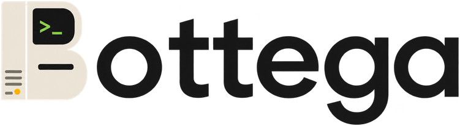

<p align="center">
  
</p>

[文档首页](../README.zh-CN.md) · [English](./README.md) · [功能](../features/README.zh-CN.md) · [更新日志](../changelog/README.zh-CN.md)

# 快速开始

Bottega 是一个本地优先的 macOS AI 编程 Agent 工作台。它连接你电脑上已经安装并登录的 Codex、Claude Code、Kimi Code 和 OpenCode CLI，再通过 Base、App、流程、Memory、浏览器工具与多 Agent 协作，为对话补上可持续使用的工作结构。

项目仍处于早期快速演进阶段，接口与存储格式可能直接断代，不保证提供兼容层。

## Bottega 文件夹

0.1.5 引入 Bottega 文件夹：磁盘上的一个文件夹，在首次设置时选定，保存你可读的内容。Chat 转录、原始附件、保存的产物、Chat Home 文件、Project 信息、Base 记录、App 源码与 Skills 都在其中；账号设置、加密密钥、设备授权与执行记录仍留在每台电脑的应用数据目录。

文件夹格式 v1 是承诺升级支持的起点。备份本机内容时，请完全退出 Bottega，再复制整个文件夹。运行中复制只能作为尽力恢复的来源：可能包含不完整的消息或缺失文件，恢复时会报告这些缺口。确认副本可用前请保留原件；仅存在于 Cloud Sync 的内容仍需下载到本机。

在**同一台电脑**上重装 Bottega、清空应用数据或换一个 profile 后，在首次设置中选择同一个文件夹：已保存的内容可离线查看，目录仍在的 Project 零操作恢复可用，这台电脑在账号里的身份也不变。移动过位置的外部 Project 文件夹需要重新关联，清掉授权的 App 需要重新授权。恢复后的 Agent 会话只有在保存的历史边界可验证时才续接，否则 Bottega 会用保存的历史开启新会话并明确说明。

### 一个 Bottega 文件夹属于一台电脑

一台电脑第一次同步时，会把自己记为该文件夹的归属方：既记在账号里，也写进文件夹内的 `publisher.json` 标记。此后这个文件夹就属于那台电脑。

- **同一台电脑**（重装、清空应用数据、换 profile）打开它，静默接管，不询问、不丢内容。
- **另一台电脑**被拒绝，并指名归属方：「这个 Bottega 文件夹属于电脑 *名称*，当前版本不支持在另一台电脑上打开；新建一个文件夹，或在那台电脑上使用。」在那台电脑上换一个文件夹，或回到拥有它的电脑上使用。即使改写或删除文件夹内的标记，服务端仍会拒绝。
- **从未同步过的文件夹**没有归属，在任何电脑上都能打开。

因此 0.1.6 不支持把备份恢复到另一台电脑，也不支持把同一个文件夹在两台电脑之间搬。阅读不受影响：一台电脑已发布的内容，无论它是否醒着，都能在浏览器和你的其他电脑上读取。要在多台电脑上工作，请使用 Cloud Sync，而不是复制文件夹。

需要换位置时，使用 设置 › 通用 里的 **移动文件夹**：Bottega 会重启并在打开前移动文件夹，所有保存的路径随之更新。移到另一块磁盘时会先完整复制并核对，再把旧副本移入废纸篓；有 Agent 正在工作时会拒绝移动。设置 › 通用 也会显示当前位置，并可在文件管理器中打开。如果启动时找不到文件夹，Bottega 会明确提示，并提供**定位文件夹…**或**改用新文件夹…**；新文件夹会得到一份对话副本，Project、Base、App 与 Skills 仍留在旧文件夹里。修改或删除文件夹内的转录文件，不会反向修改或删除 Bottega 中的对话。

不支持把该文件夹放在 iCloud Drive、Dropbox、OneDrive 等网盘同步目录中。需要多设备并行使用时，请使用 Cloud Sync。

本机 Chat 数据库无法打开时，启动会提供恢复操作，包括在保留旧数据库的前提下从文件夹重建对话。尚未完成的回复可能缺失，搜索索引与同步状态会重新建立。

### 全新安装

首次设置只有一条路径，全程不涉及账号：选择 Bottega 文件夹 → 配置 Agent（也可以点**稍后再装**）。Skills 与长期 Memory 可之后在设置中配置。选择空文件夹即可从头开始，选择这台电脑用过的 Bottega 文件夹则重新打开其中的内容。任何一次安装都要经过这一步，从旧版本升级也一样。登录是之后在设置里进行的步骤，见 [Cloud Sync 与 Cloud Web](#cloud-sync-与-cloud-web)。

## Bottega 的差异化价值

- **继续使用你已经信任的 Agent。** Bottega 通过 ACP 连接官方本地 CLI，不复制、不迁移、也不代管凭据。
- **让对话成为工作空间。** Chat 可以拥有结构化 Base 数据、可复用 App、文件、浏览器标签页与长期上下文，而不是止步于一份孤立转录。
- **协调多个 Agent。** Plan、Steer、Section、Subagent 与结果提升，让并行工作可见、可接力、可复用。
- **权限始终显式。** 文件、App、工具、Memory 与跨 Chat 访问都通过有边界的 capability 授权，而不是默认获得环境中的全部权限。

产品模型与四个核心能力域见[功能文档](../features/README.zh-CN.md)。

## 环境要求

- 一台 Apple 芯片的 Mac
- 至少安装一个受支持的 CLI：
  - Codex CLI 0.145.0 或更高版本
  - Claude Code 2.1.216 或更高版本
  - Kimi Code 0.29.1 或更高版本
  - OpenCode 1.18.13 或更高版本
- 从源码构建：Node.js 24，pnpm 11.9 或更高版本

启动 Bottega 前，请先在对应官方 CLI 中完成登录。Bottega 不会要求或导入这些凭据。

## 升级到 0.2.2

Cloud Sync 现使用协议 15。使用云功能的所有电脑都需升级到 0.2.2 后重新连接。已有云端内容、同步密码与账号密钥保留。请完全退出 Bottega，备份 Bottega 文件夹和应用数据，再用已核验的 0.2.2 下载替换应用。本次预发布仅支持手动更新，使用 ad-hoc 签名，未经 Apple 公证。

## 下载与安装

[下载 0.2.1](https://github.com/thinkingjimmy/Bottega/releases/tag/v0.2.2)，本次提供 **Apple 芯片的 macOS 安装包**。该版本标记为预发布，不进入 GitHub Latest。Windows、Linux 与 Android 发行另行安排。[Bottega Web](https://app.getbottega.app) 已可在电脑和手机浏览器中使用。

| 平台 | 安装包 | 说明 |
| --- | --- | --- |
| macOS（Apple 芯片） | `Bottega-0.2.2-arm64.dmg` 或 `Bottega-0.2.2-arm64-mac.zip` | 手动安装与更新。 |

Apple Developer 资格仍在审核中。本次安装包使用 **ad-hoc 签名**，**没有 Developer ID 签名，也未经过 Apple 公证**。自动更新已关闭；后续版本请从 Releases 页面下载并手动替换。

1. 完全退出 Bottega，备份 Bottega 文件夹与应用数据目录。
2. 从同一版本页面下载安装包和 `release-manifest.json`。运行下方命令，将输出与清单中对应安装包的 `sha256` 手动比较；下载 ZIP 时请替换为 ZIP 文件名：

```bash
shasum -a 256 Bottega-0.2.2-arm64.dmg
```

3. 打开 DMG，将 Bottega 拖入「应用程序」；使用 ZIP 时，解压后将应用复制到该目录。
4. 如果 Gatekeeper 拦截下载，在确认来源与摘要一致后，仅移除这个应用的隔离标记，然后启动：

```bash
xattr -rd com.apple.quarantine /Applications/Bottega.app
```

预发布期间继续进行详细功能与实机走查，后续修复将以 0.2.x 交付。

## Cloud Sync 与 Cloud Web

登录是可选的。纯本地使用不需要账号，也不会积累上传队列，首次设置里根本不会提到账号。

- **在浏览器里登录。** Bottega 打开系统默认浏览器完成 Google 登录，你在浏览器里选中那台电脑上 Bottega 显示的验证码来批准该请求，桌面应用再接续会话。登录方式只有 Google，Bottega 不会索取该密码。入口在设置的同步一栏。
- **同步密码只设一次。** 账号里的第一台电脑设置一个独立的同步密码，至少 12 个字符，包含字母与数字，至少 5 个不同字符，不能以大段重复或连续字符为主，不能包含邮箱名、`bottega` 或最常见的密码；表单会随输入逐条打勾。它与 Google 密码无关。之后登录的每个设备——另一台电脑、Cloud Web、手机浏览器——输入同一个密码。只有桌面能设定密码，所以浏览器登录一个全新账号时会被告知「先在一台电脑上登录」，而不是被要求输入一个它无法设定的密码。
- **如何保护。** 加密内容的密钥在你自己的设备上用 Argon2id 从该密码派生，内容在离开电脑前用 XChaCha20-Poly1305 封装，服务端只保存密文。
- **没有密码找回。** 没有恢复密钥、没有其他设备批准、没有重置入口。密码丢失且没有任何已登录设备还能解密时，仅存在于云端的内容无法恢复。创建加密空间前 Bottega 会明确说明这一点，并要求你确认。
- **一个账号一个加密空间。** 第二台电脑选择自己的 Bottega 文件夹，用同一账号登录，再输入同一个同步密码加入。
- **退出登录**只停止这台电脑发布内容与接受命令，不删除任何东西：它已经发布的内容仍可在浏览器和你的其他电脑上阅读，并标注为已退出登录。清除这台电脑的云端副本是设置里另一个动作，删除账号又是另一个。
- **Cloud Web。** 在 [app.getbottega.app](https://app.getbottega.app) 登录后，可以阅读带工具过程和附件的 Chat，搜索聊天标题及最近 7 天的消息正文，使用 Base 的六种视图，读取和编辑已同步的 App 记录，恢复或删除归档项目，管理设备与偏好，并跟进流程运行——开始运行、确认、决定，处理**等你处理**里的所有事项。静态与 Base 型 App 的界面也能在这里打开；server 型 App 的界面、应用内浏览器和本机工具仍在你的电脑上运行。支持手机浏览器；已验证的浏览器是 Chrome。

### 登录即远程操作

一台登录的电脑会把自己的侧栏——它的 Project 与 Chat——发布到账号，并接受针对它们的命令。产品里没有第二个远程开关：设置的同步一栏只有登录状态、本机显示名和退出登录。

**选择你正在看的那台电脑。** 账号里出现第二台电脑后，Cloud Web、手机与桌面的侧栏顶部都会出现电脑切换器；只有一台电脑时无从选择，也不显示。每个标签是一台电脑，醒着时带一个小圆点，离线时显示「离线 · 5 分钟前」。桌面永远把自己排在第一位。切换器下方的侧栏就是那台电脑的 Project 与 Chat。电脑可以在设置里改名；新电脑注册时若与已有电脑同名，会自动加上「(2)」，随时可改。

**操作它。** 电脑醒着时，可以从 Cloud Web、手机浏览器或另一台桌面发送消息、实时查看回复、停止、批准或拒绝权限请求、回答追问、插话与追加消息。两个设备可以同时操作同一条 Chat：两条消息按到达顺序排队，两次停止算一次，对同一个权限请求的第二次回答会得到一行「已在 *电脑* 处理」，而不是一个错误。

**使用另一台电脑的 Project。** 属于另一台电脑的 Project 会带一个地球角标和那台电脑的名字，并且不提供目录、路径或「选择文件夹」——它在这里本来就没有目录。在它下面新建的 Chat 会在那台电脑上创建、执行和存储。桌面侧栏 Projects 分组的 `+` 现在有两项：**本地 Project** 或 **钉住远端 Project…**；钉住只是把另一台电脑的 Project 放进这台电脑的侧栏，不复制任何内容，取消钉住对拥有它的电脑毫无影响；拥有者删除或归档该 Project 后，这一行仍在并标注状态，菜单里只剩「取消钉住」。

**电脑睡着或离线时。** 它的 Chat 仍可阅读，改名、归档、调整顺序、编辑 Base 行、写 App 记录也都照常成功，等它醒来后对账。需要它醒着的只有执行类动作——发送、停止、批准、回答、插话、删除 Chat——这些控件会就地置灰并说明原因，草稿留在输入框里，电脑醒来后约半分钟内自行恢复。笔记本合盖约 90 秒后被视为离线。

Bottega 保留一个服务端总开关，必要时可以为所有人关闭远程操作。关闭期间，浏览器里的 Chat 为只读；阅读转录和实时观看运行中的轮次仍然可用。

<a id="升级到-021"></a>

## 升级到 0.2.1

请完全退出 Bottega（包括后台运行），备份内容文件夹与应用数据目录，再用 0.2.1 下载包替换应用。本次预发布继续使用手动更新。

本次补丁保持协议 14，保留已有云端内容与同步密码。0.2.0 安装可以直接重新连接，无需重置账号或数据。首次设置简化为两步，Skills 与 Memory 从设置中配置；需要新增 Agent 历史时，在 Project 设置中手动导入。

<a id="升级到-020"></a>

## 升级到 0.2.0

请完全退出 Bottega（包括后台运行），备份 Bottega 文件夹与应用数据目录，再手动下载并替换应用。本次预发布关闭自动更新。

生产服务已使用**协议 14**。需要云同步或远程操作的每台电脑都应更新到 0.2.0；旧协议 13 的桌面必须升级后才能重新连接。本次发布保留已有云端内容，同步密码不变，没有重置服务数据。

Bottega Dock 位于 设置 › 插件 › Dock。本版本支持与系统程序坞共存，可选择显示器以及左侧、底部或右侧停靠；暂不提供替代系统程序坞的模式。

如果从 0.1.8 或更早版本升级，还请阅读下方对应的历史迁移说明；0.2.0 不会撤销此前已经发生的数据库或云端迁移。

<a id="升级到-019"></a>

## 升级到 0.1.9

安装前请完全退出 Bottega（包括后台进程），并同时备份 Bottega 文件夹与完整的应用数据目录。

**0.1.9 不会打开 0.1.8 的 Chat 数据库。** 首次启动时，原来的 `bottega.sqlite3` 及其附属文件会被原字节移到应用数据目录下的 `recovery/sqlite/`，对话索引则从你的 Bottega 文件夹重建。未写完的回复可能缺失，搜索索引与同步状态会重新建立。设置、Project、Base、已安装的 App、Dock 布局与 Memory 设置都会保留。

**0.1.9 之前的云端数据不会保留。** 同步协议升到 13，服务在这次发布时已重置，旧版本上传的内容不再保留。请重新登录：第一台登录的电脑重新设定同步密码，其余电脑、浏览器与手机输入这个新密码。0.1.8 的桌面已无法同步，请把账号下的每台电脑都更新；Windows 与 Linux 上的安装会停留在 0.1.8，直到这两个平台恢复。

设置 › Lab 及其中的 **Keep Agent connections** 开关已移除。Development Kanban 不再随包提供，已安装的副本照常可用。Agent 配置、插件与流程都是新功能，初始为空。Agent 回合不再能读取 GitHub CLI 的配置目录，各 Agent CLI 自己的登录不受影响。

<a id="升级到-018"></a>

## 升级到 0.1.8

无需任何准备。0.1.8 原样打开 0.1.7 的 Chat 数据库、设置与 Bottega 文件夹，云端数据也保留。

同步协议升到 10，服务已经切换。登录同一账号的 0.1.7 桌面会被要求先更新才能继续同步，请把账号下的每台电脑都更新。同步密码不变。

Bottega Dock 默认关闭，在 设置 › Dock 里开启，需要 macOS 15 及以上的 Apple 芯片电脑。选择替代系统程序坞时，Bottega 会在 系统设置 › 通用 › 登录项与扩展 里加一个恢复项；替代开启期间它一直保持注册，确保系统程序坞随时能恢复。要回到系统程序坞，选择 **恢复系统程序坞** 或关闭 Bottega Dock。

<a id="升级到-017"></a>

## 升级到 0.1.7

无需任何准备。0.1.7 原样打开 0.1.6 的 Chat 数据库、设置与 Bottega 文件夹，云端数据也保留。新 Chat 改为从一个明确的默认 Agent 开始，初始为 Codex，可在 设置 › Providers 里改成你常用的那个。

同步协议升到 9，服务已经切换。登录同一账号的 0.1.6 桌面会被要求先更新才能继续同步，请把账号下的每台电脑都更新。同步密码不变——更强的规则只在设定新密码时生效。

<a id="升级到-016"></a>

## 升级到 0.1.6

**0.1.6 不会打开 0.1.5 的 Chat 数据库。** 首次启动时，原来的 `bottega.sqlite3` 及其附属文件会被原字节移到应用数据目录下的 `recovery/sqlite/`，对话索引则从你的 Bottega 文件夹重建——文件夹才是内容的真相。未写完的回复可能缺失，搜索索引与同步状态会重新建立。

**0.1.5 的云端数据不会保留。** 0.1.6 更换了同步协议，服务在发布前会被重置，0.1.5 上传的内容不再保留。请重新登录：第一台登录的电脑重新设定同步密码，其余电脑、浏览器与手机输入这个新密码。

安装前请完全退出 Bottega（包括后台进程），并同时备份 Bottega 文件夹与完整的应用数据目录。如果重建之后有任何异常，把应用数据目录整体移到备份位置、从空白目录重新开始仍然是干净的做法，步骤与下一节的 0.1.5 相同，区别只在于：在同一台电脑上重新选择**同一个** Bottega 文件夹，而不是新建一个。

注意：Bottega 文件夹现在属于发布它的那台电脑，因此备份无法恢复到另一台电脑，见[一个 Bottega 文件夹属于一台电脑](#一个-bottega-文件夹属于一台电脑)。

<a id="升级到-015"></a>

## 升级到 0.1.5

0.1.5 把内容保存在首次设置时选择的 Bottega 文件夹中，不会导入 0.1.4 及更早版本的 Chat、Project、App、Base、附件与设置。旧应用数据目录中的内容不会被修改或删除，只是不会被读取。

1. 完全退出 Bottega，包括后台进程，备份完整的应用数据目录，并保留外部 Chat Homes 与项目目录。
2. 将应用数据目录移到备份位置，不要删除。macOS 用户退出应用后可以执行：

```bash
bottega_data="$HOME/Library/Application Support/Bottega"
bottega_backup="${bottega_data}.backup-$(date +%Y%m%d-%H%M%S)"
mv -n "$bottega_data" "$bottega_backup"
```

3. 安装并启动 0.1.5，重新完成引导。按提示选择一个新的空文件夹作为 Bottega 文件夹，此后[Bottega 文件夹](#bottega-文件夹)一节的说明全部适用。旧版 Bottega 聊天、设置和已安装 App 记录不会自动导入；外部项目文件与官方 CLI 凭据仍保留在原位置。

应用数据目录的位置、「移动整个目录而不是单个文件」的规则，以及恢复备份的步骤与 0.1.4 相同，见下一节。从 0.1.3 及更早版本升级时同样适用上述准备。

<a id="升级到-013"></a>

## 升级到 0.1.4

0.1.4 不迁移 0.1.3 及更早版本的本地存储格式。已有聊天数据库会使启动停止并报告 schema 错误；重新安装应用不会改变该数据库。

1. 完全退出 Bottega，包括后台进程，备份完整的应用数据目录，并保留外部 Chat Homes 与项目目录。
2. 开始使用 0.1.4 时，将应用数据目录移到备份位置，不要删除。macOS 用户退出应用后可以执行：

```bash
bottega_data="$HOME/Library/Application Support/Bottega"
bottega_backup="${bottega_data}.backup-$(date +%Y%m%d-%H%M%S)"
mv -n "$bottega_data" "$bottega_backup"
```

3. 安装并启动 0.1.4，重新完成引导。旧版 Bottega 聊天、设置和已安装 App 记录不会自动导入；外部项目文件与官方 CLI 凭据仍保留在原位置。

正式安装版的数据目录为：macOS 的 `~/Library/Application Support/Bottega`、Windows 的 `%APPDATA%\Bottega`、Linux 的 `$XDG_CONFIG_HOME/Bottega`（通常为 `~/.config/Bottega`）。应移动整个目录，包括数据库附属文件和相关记录；只移动 `bottega.sqlite3` 会留下不一致状态。开发构建使用独立的 `@ai-chat/desktop` 数据目录。

若仍需通过旧版访问原有数据，请保留备份原样。恢复时先退出 0.1.4，另行归档它的新数据目录，再恢复原目录并打开对应旧版本。

## 从源码构建

```bash
git clone --recurse-submodules https://github.com/thinkingjimmy/Bottega.git
cd Bottega
corepack enable
pnpm install
node apps/desktop/scripts/node-runtime/fetch-node.mjs --dev-manifest
pnpm dev
```

如果 clone 时没有拉取 submodule，请先初始化随仓库固定的第一方 App：

```bash
git submodule update --init --recursive
```

常用命令：

```bash
pnpm typecheck   # Validate TypeScript
pnpm build       # Build the Electron application
pnpm dist        # Build a local installer
```

`fetch-node.mjs` 会一次性下载并校验锁定版本的 Node 运行时，存入用户缓存；之后 `pnpm dev` 离线使用它。`pnpm dist` 会在 Apple 芯片的 Mac 上生成本地安装包。签名发行需要自行配置 Apple 签名身份；本地构建并不等同于本次已验证的预发布下载包。

首次启动时，选择 Bottega 文件夹并等待 Bottega 检测本机 CLI；**稍后再装**可以跳过 Agent 这一步。Skills 与长期记忆是同一向导中的可选步骤，之后也可以在设置中调整。文件夹与至少一个后端就绪后，即可创建任务，并在发送首条消息前选择 Agent。登录不在首次设置里。

## 仓库边界

本仓库只承载公开产品源码：Electron 桌面应用、共享 UI 包、生产资源与里程碑文档。

托管 Web 应用与后端单独运行。本源码仓库聚焦桌面应用、共享包，以及构建和使用它所需的产品文档。

## 如何协作

Bug、产品反馈与功能建议，请直接提交到 [GitHub Issues](https://github.com/thinkingjimmy/Bottega/issues)。

**现阶段不接受 Pull Request。** Bottega 仍在快速变化，内部经常进行大规模重构；在持续移动的架构上审阅外部 patch 会拖慢主开发路径。请把问题或方案写进 Issue。此阶段创建的 Pull Request 会直接关闭，不进入评审。

## 协议

Bottega 使用 [MIT License](../../LICENSE)。
